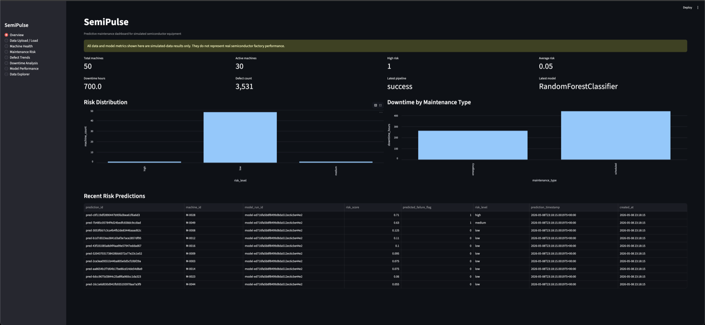
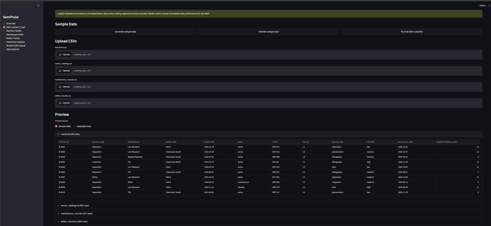
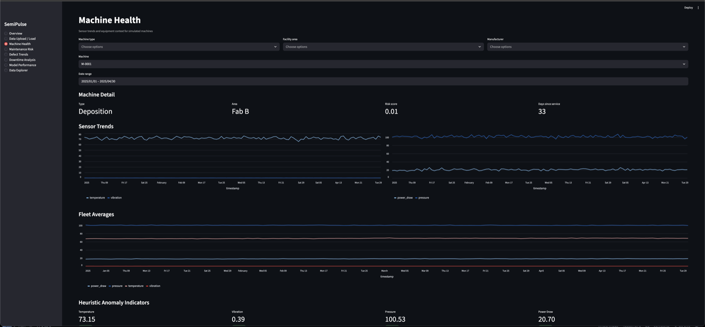
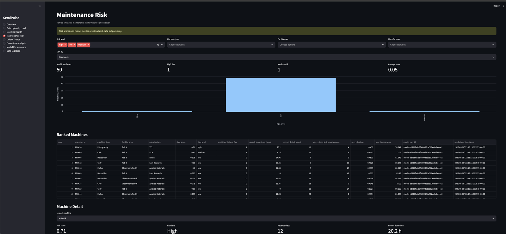
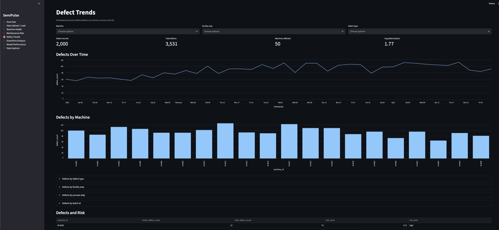
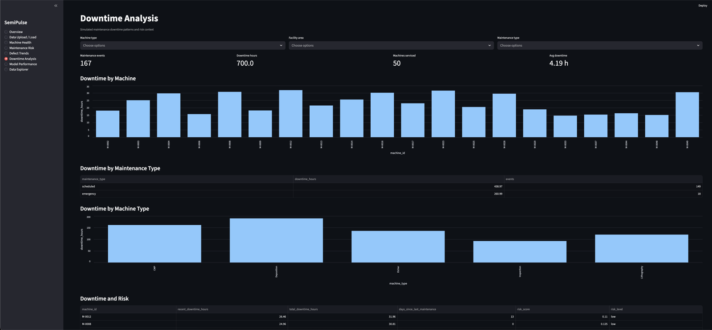
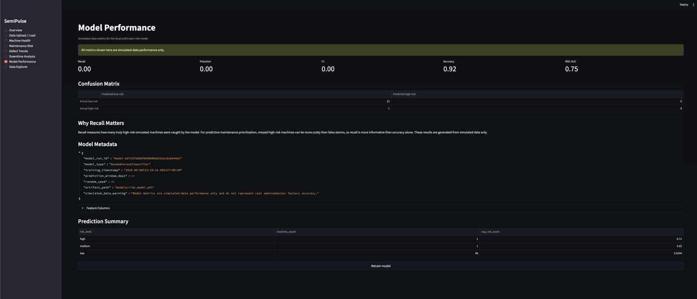
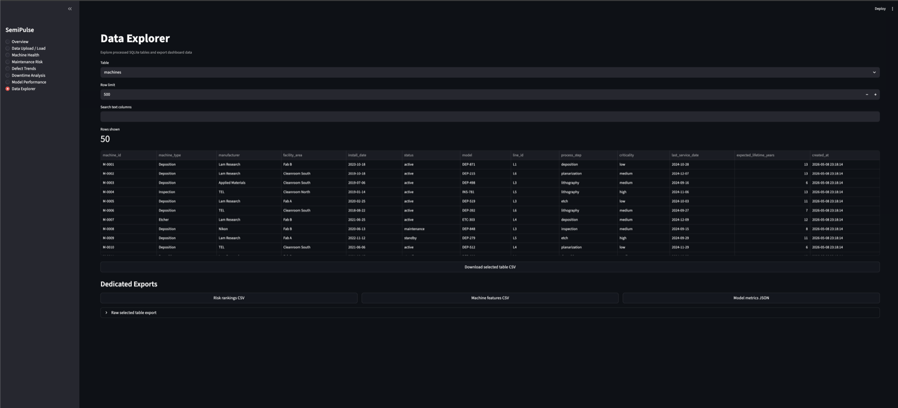

# SemiPulse: Predictive Maintenance Dashboard

SemiPulse is a simple dashboard demo for predictive maintenance. In plain English, it pretends to watch semiconductor factory machines and helps decide which machines may need attention first.

This project shows a full data workflow:

1. Create simulated factory machine data.
2. Clean and check the data.
3. Store it in a SQLite database.
4. Build machine-level features.
5. Train a local scikit-learn model.
6. Show the results in a Streamlit dashboard.

## Important Note

All data in this project is simulated. The model metrics are also simulated-data results. This project does not claim real semiconductor factory accuracy.

## How To Run It

### Option 1: Run With Docker

This is the simplest way if Docker Desktop is installed.

1. Open a terminal in this project folder.
2. Run:

```bash
docker compose up --build
```

3. Open this in your browser:

```text
http://localhost:8501
```

4. To stop it, press `Ctrl-C`, then run:

```bash
docker compose down
```

### Option 2: Run With Python

Use this if you want to run it directly on your machine.

1. Create and activate a virtual environment:

```bash
python3 -m venv .venv
source .venv/bin/activate
```

2. Install the packages:

```bash
pip install -r requirements.txt
```

3. Generate the demo data:

```bash
python -m semipulse.sample_data
```

4. Build the database, train the model, and create predictions:

```bash
python - <<'PY'
from semipulse.pipeline import run_demo_pipeline
print(run_demo_pipeline(generate_data=False, reset_database=True, train_model=True))
PY
```

5. Start the dashboard:

```bash
streamlit run app/streamlit_app.py
```

6. Open:

```text
http://localhost:8501
```

## What A Recruiter Is Seeing

This is not just a static chart. It is a working data application. The app creates data, validates it, stores it, trains a model, scores machine risk, and lets the user explore the results.

The dashboard is designed to answer practical business questions:

- Which machines look risky?
- Which machines have more downtime?
- Which machines show unusual sensor behavior?
- Where are defects showing up?
- How well did the model perform on the simulated data?
- Can the data be exported for follow-up analysis?

## Dashboard Tour

### Overview



The Overview page is the executive summary. It shows the number of machines, active machines, high-risk machines, total downtime, defect count, and the latest model used.

### Data Upload / Load



This page is where the demo data enters the system. A user can generate sample data, upload CSV files, validate the data, preview tables, and rebuild the database.

### Machine Health



This page focuses on one machine at a time. It shows sensor trends such as temperature, vibration, pressure, and power draw so a user can inspect machine behavior.

### Maintenance Risk



This page ranks machines by risk score. A maintenance team would use this view to decide which machines should be checked first.

### Defect Trends



This page shows where defects are happening in the simulated manufacturing process. It helps connect production quality issues with machine risk.

### Downtime Analysis



This page shows which machines and machine types are creating downtime. It helps explain where maintenance time is being spent.

### Model Performance



This page shows how the model performed on the simulated data. It is intentionally honest: the current simulated run has weak recall, so the app does not pretend the model is production-ready.

### Data Explorer



This page lets a user inspect the database tables directly and download CSV or JSON exports, including risk rankings, machine features, model metrics, and selected tables.

## What Is Built

- Simulated machine, sensor, maintenance, and defect datasets.
- CSV validation for missing columns, bad timestamps, duplicate IDs, numeric issues, and machine ID mismatches.
- SQLite database tables for machines, sensor readings, maintenance records, defect records, features, model runs, predictions, pipeline runs, and data quality issues.
- Feature engineering with Pandas.
- Local scikit-learn `RandomForestClassifier` model.
- Streamlit dashboard with eight pages.
- CSV and JSON exports.
- Docker support for local reproducible execution.
- Pytest coverage for data validation, database helpers, feature generation, model training, exports, pipeline orchestration, and Streamlit app rendering.

## Architecture

```text
CSV / generated sample data
        -> validation + cleaning
        -> SQLite tables
        -> feature engineering
        -> scikit-learn model training
        -> risk predictions + model metrics
        -> Streamlit dashboard + exports
```

## Key Files

- `app/streamlit_app.py`: starts the dashboard.
- `app/pages/`: dashboard pages.
- `semipulse/sample_data.py`: creates simulated data.
- `semipulse/data_loader.py`: cleans data and rebuilds SQLite.
- `semipulse/features.py`: creates machine-level features.
- `semipulse/model.py`: trains the risk model.
- `semipulse/predict.py`: writes risk predictions.
- `semipulse/exports.py`: creates CSV and JSON downloads.
- `db/schema.sql`: SQLite database schema.
- `Dockerfile`: packages the app.
- `docker-compose.yml`: runs the app locally with Docker.

## Tests

```bash
pytest
```

The current test suite verifies the data pipeline, model pipeline, exports, and Streamlit app startup.

## Limitations

- The data is simulated.
- The model results are simulated-data performance only.
- SQLite is used for a local demo, not high-concurrency production traffic.
- The dashboard is a portfolio MVP, not a production factory system.
